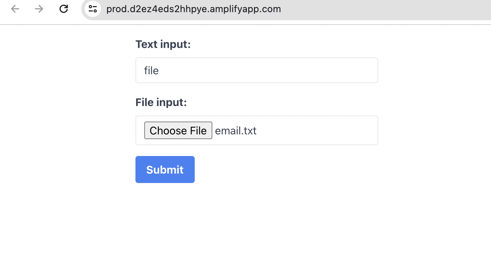
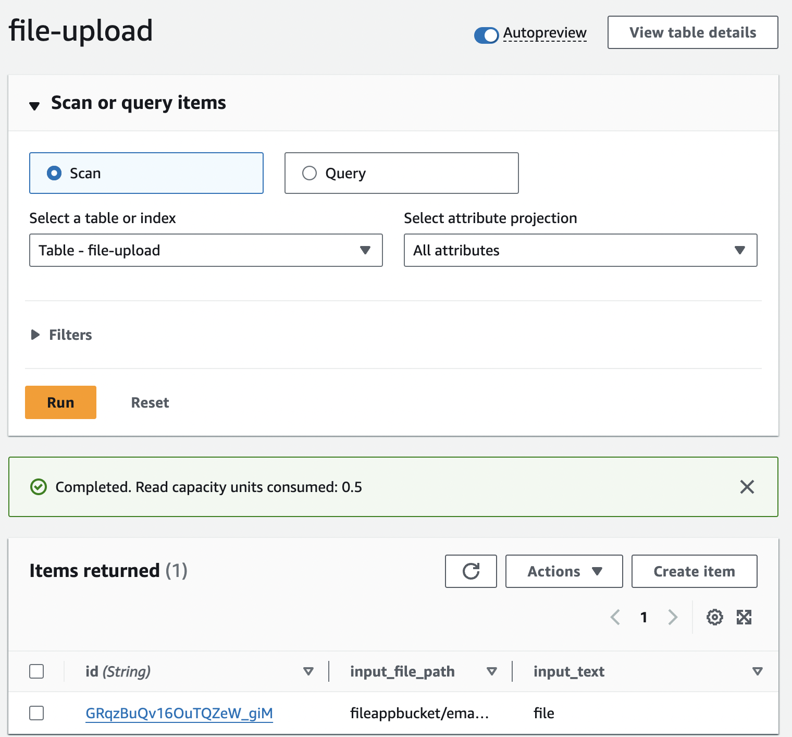
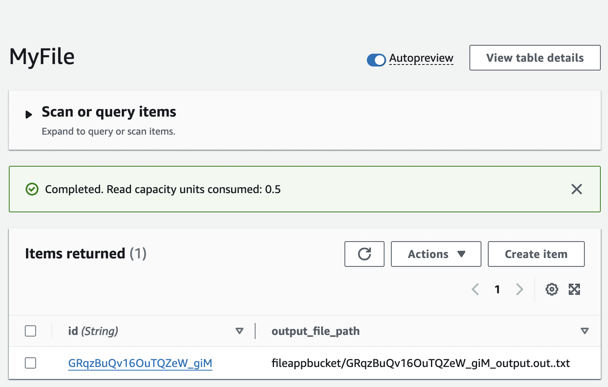
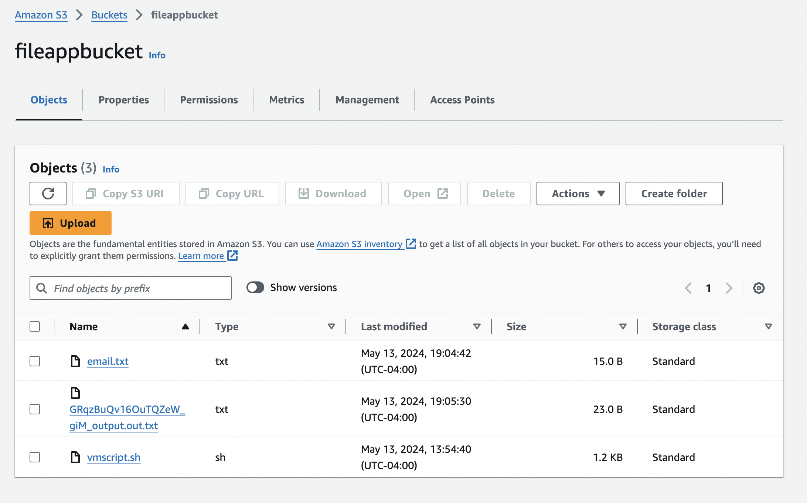
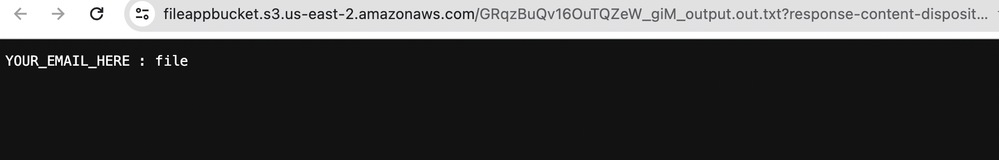

- Application URL: https://prod.d2ez4eds2hhpye.amplifyapp.com/

### Repository Guide
**fovus-coding-challenge/frontend**
- **Description:** `React.js` User Interface (UI) code.
- **Instructions to set up**
  - Install `node
  - .js` latest version.
  - download `fovus-coding-challenge/frontend/my-app` directory to local.
  - Run ```npm install``` on the root directory where the `package.json` file located to install dependencies
  - Run ```npm start``` to start application locally.

**fovus-coding-challenge/backend**
- **Description:** This folder contains 3 lambda codes
  - **s3lambda:** This `Node.js` lambda code runs in Amazon Web Services(AWS) and contains the code to generate pre signed url of s3 bucket.
    This is done to avoid any AWS access keys or credentials in the code(not in config, not in env, not hardcode, no placeholder, follow best practices).
  - **dblambda:** This `Node.js` lambda code runs in AWS and contains the code to update dynamodb with the file details.
  - **vmlambda:** This `Node.js` lambda code runs in AWS and contains the code to create virtual machine(VM) and run the `vmscript.sh` file 
    to meet the requirements.

**vmscript.sh**
- **Description:** contains script that runs as a userData script on VM launch on AWS Virtual Private Cloud(VPC).

### Demo workflow video and screenshots
https://drive.google.com/file/d/1GYXVy4V2JDCqn-2qkbxaNHsaxXakzAHN/view?usp=sharing

- Responsive web UI (use ReactJS) with a text input and a file input. 
  - Text input: "[InputText]"
  - File input: [InputFile].txt
  - [InputFile].txt content: "[File Content]"
  - Submit button


- Upload the input file to S3 from the browser directly (do not send the file content directly to Lambda, do not get credentials from Cognito)
  - S3 path: [BucketName]/[InputFile].txt
  - Achieved using [PreSignedURL][1]


- Save the inputs and S3 path in DynamoDB FileTable via API gateway and Lambda Function, 
  - id: {1} // auto-generated id via nanoid
  - input_text: [InputText]
  - input_file_path: [BucketName]/[InputFile].txt
  

- After the file is uploaded in S3 and added to DynamoDB, trigger a script run in a VM instance (EC2) via the DynamoDB Event.
  - Create a new VM automatically [4] 
  - Download the script from S3 to the VM (Upload the scripts to S3 via CDK or programmatically as the InputFile)
  - Run the script in the VM
    - Get the inputs from DynamoDB File Table by id
    -   Download the input file from S3 [BucketName]/[InputFile].txt to the VM
    -    Append the retrieved input text to the downloaded input file and save it as [OutputFile].txt
      -    [OutputFile].txt content: "[File Content] : [InputText]"
    -    Upload the output file to S3
      -    S3 path: [BucketName]/[OutputFile].out.txt
    -    Save the outputs and S3 path in DynamoDB File Table 
      -  id : {1}
      -  output_file_path: [BucketName]/[OutputFile].out..txt 
  - Terminate the VM automatically



  
### AWS Environment video
- AWS Environment - https://drive.google.com/file/d/1LYgUNL5Fz9qgJRCF2wbaHXdusHn5wWTT/view?usp=sharing
- AWS IAM - https://drive.google.com/file/d/1ubFH40P57nBSu1KNKYdDwDnhY441a3XM/view?usp=sharing

### Check on meeting the Basic Requirements & few Bonus as well
- ✓ Use AWS CDK to manage all AWS infrastructure (latest version, TypeScript)
  - CDK project is attached and also CloudFormation Iac yaml file as well
- ✓ Use AWS SDK JavaScript V3 for Lambda (latest version, not V2)
  - latest node.js version is used
- ✓ Do not put any AWS access key / credentials in your code. (not in config, not in environment, no hard code, no place holder, follow AWS best practices)
  - Achieved using pre-signed-urls and apis manually defined [1]
- ✓ No SSH and no hard-coded parameters.
  - No hard-coded parameters are used and no SSH params are used
- ✓ Your parameter/variable names, file names and folder names are reader-friendly and professional. Your txt file in S3 is not public. One user one folder. No shared folder.
  - Followed as shown in code and demo.
- ✓ Do not use any AWS Amplify frontend or backend resources.
  - Used Amplify only for hosting, not used for anything else
- ✓ Follow the AWS Best Practices.
  - Followed AWS best practices (IAM roles, policies, **principle of least privilege**, security, networking and others)
- ✓ After saving the inputs and S3 path in DynamoDB File Table [2], your system will create a new VM based on the event (not a pre-provisioned VM) and trigger the script to run automatically with error handling (no sleep).
  - _vmscript.sh_ [5] has error handling as well, so no break in the code. sleep is not used, only exit.
- ✓ Professional code and reader-friendly README file.
  - Followed
- ✓ **Bonus** Use Flowbite Tailwind CSS and ReactJS for Responsive UI [3]
- ✓ **Bonus** Your frontend code is hosted in Amplify (use Amplify hosting for CICD, but do not use any Amplify frontend or backend resources in your code)

### References
[1]: https://docs.aws.amazon.com/AmazonS3/latest/userguide/using-presigned-url.html
[2]: https://docs.aws.amazon.com/amazondynamodb/latest/developerguide/Streams.Lambda.html
[3]: https://tailwindcss.com/docs/guides/create-react-app
[4]: https://docs.aws.amazon.com/sdk-for-javascript/v2/developer-guide/ec2-example-creating-an-instance.html
[5]: https://www.bluematador.com/learn/aws-cli-cheatsheet
```
[1]: https://docs.aws.amazon.com/AmazonS3/latest/userguide/using-presigned-url.html
[2]: https://docs.aws.amazon.com/amazondynamodb/latest/developerguide/Streams.Lambda.html

[3]: https://tailwindcss.com/docs/guides/create-react-app

[4]: https://docs.aws.amazon.com/sdk-for-javascript/v2/developer-guide/ec2-example-creating-an-instance.html

[5]: https://www.bluematador.com/learn/aws-cli-cheatsheet
```
Note: IacTemplate.yaml is attached from cloudformation to a picture of environment.
